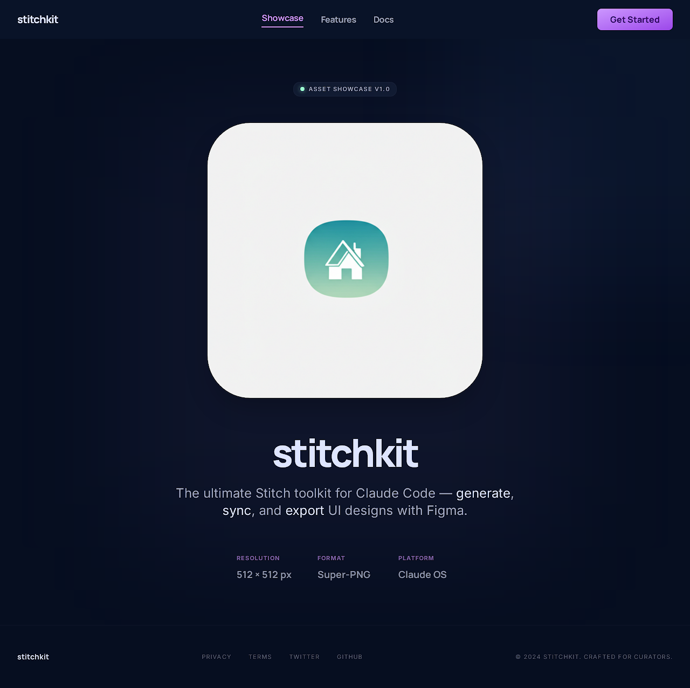
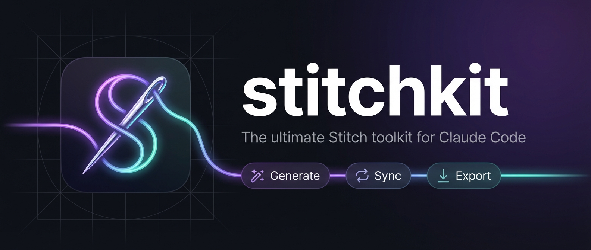

<p align="center">
  
</p>

<h1 align="center">stitchkit</h1>

<p align="center">
  <strong>The ultimate Stitch toolkit for Claude Code</strong><br>
  Design skills, prompt templates, and MCP setup for Google Stitch & Figma.
</p>

<p align="center">
  <a href="https://github.com/tygwan/stitchkit/blob/main/LICENSE"></a>
  <a href="https://github.com/tygwan/stitchkit"></a>
</p>

<p align="center">
  
</p>

---

## What is stitchkit?

**stitchkit** is a [Claude Code plugin](https://docs.anthropic.com/en/docs/claude-code) that supercharges your design workflow. It bundles:

- **MCP Setup** — One-command installation of Google Stitch, Figma, and NanoBanana MCP servers
- **Design Skills** — Expert prompting skills for generating UI designs with Stitch
- **Prompt Templates** — Ready-to-use templates for 22+ web page types
- **Agents** — Autonomous design exploration agent

## Prerequisites

You will need API keys / tokens for the MCP servers bundled in this plugin:

| MCP Server | Key Required | Where to Get It |
|---|---|---|
| **Google Stitch** | Google account (OAuth) or `GOOGLE_API_KEY` | [Google Cloud Console](https://console.cloud.google.com/) > APIs & Services > Credentials |
| **Figma** | `FIGMA_ACCESS_TOKEN` | [Figma](https://figma.com) > Settings > Security > Personal access tokens |
| **NanoBanana** | `GOOGLE_AI_API_KEY` (or `GEMINI_API_KEY`) | [Google AI Studio](https://makersuite.google.com/app/apikey) (free) |

> The plugin auto-registers all three MCP servers when installed. You just need to provide your API keys as environment variables (see [Setup](#setup) below).

## Installation

```bash
claude plugin add tygwan/stitchkit
```

Or clone manually:

```bash
git clone https://github.com/tygwan/stitchkit.git ~/.claude/plugins/stitchkit
```

## Setup

After installing the plugin, configure your API keys so the MCP servers can authenticate.

### Step 1: Set environment variables

Add the following to your shell profile (`~/.bashrc`, `~/.zshrc`, etc.) or a project `.env` file:

```bash
# Google Stitch — only needed if you skip OAuth and use API key auth
export GOOGLE_API_KEY="your-google-cloud-api-key"

# Figma MCP — required for Figma integration
export FIGMA_ACCESS_TOKEN="figd_your-figma-token"

# NanoBanana (Gemini image generation) — required for image gen
export GOOGLE_AI_API_KEY="your-google-ai-api-key"
```

### Step 2: Verify with `/stitch-setup`

Run the setup skill inside Claude Code to validate your configuration:

```
/stitch-setup
```

This will check each MCP server's connectivity and guide you through any missing credentials.

### Step 3: Start designing

```
Design a SaaS analytics dashboard with KPI cards, revenue chart, and user segments donut chart
```

The `stitch-design` skill auto-activates and handles the rest.

> **Tip:** If you only need a subset of the servers, you can skip the keys you don't need. Stitch works standalone with OAuth (no API key), and NanoBanana is optional if you don't need Gemini image generation.

## What's Included

### Skills

| Skill | Type | Description |
|---|---|---|
| `/stitch-setup` | User-invoked | Set up Stitch, Figma, and NanoBanana MCP servers with guided configuration |
| `stitch-design` | Auto-triggered | Activates on design requests — generates screens with optimized Stitch prompts |

### Agents

| Agent | Description |
|---|---|
| `design-explorer` | Autonomously generates 3-4 design alternatives for a concept, varying style/layout/color |

### MCP Servers (auto-configured)

| Server | Purpose |
|---|---|
| Google Stitch | AI-powered UI design generation, editing, variants, and HTML export |
| Figma | Design file sync, component import, and design token extraction |
| [Nanobanana](https://github.com/tygwan/nanobanana-mcp) | Gemini-powered image generation, editing, and smart model selection |

### Prompt Templates

22+ page type templates organized by category:

- **Marketing** — Landing Page, Pricing, About/Team, Blog, Portfolio
- **Product** — Dashboard, Settings, Onboarding, Chat, Feed
- **Commerce** — Product Listing, Product Detail, Cart/Checkout, Order Tracking
- **Utility** — Login/Auth, 404/Error, Search, Email/Newsletter
- **Admin** — CMS, Data Table, Kanban, Calendar

## Quick Start

### 1. Design something

```
Design a SaaS analytics dashboard with KPI cards,
revenue chart, and user segments donut chart
```

The `stitch-design` skill auto-activates, creates a Stitch project, and generates your design.

### 2. Generate images with NanoBanana

```
Generate a hero illustration for my landing page — isometric 3D style,
purple gradient background, floating dashboard elements
```

### 3. Explore alternatives

```
Use the design-explorer agent to create 4 variants
of this landing page in different styles
```

### 4. Export

```
Download the dashboard screenshot and export the HTML
```

## Plugin Structure

```
stitchkit/
├── .claude-plugin/
│   └── plugin.json              # Plugin metadata
├── .mcp.json                    # Stitch, Figma & NanoBanana MCP auto-configuration
├── skills/
│   ├── stitch-design/
│   │   ├── SKILL.md             # Design generation skill (auto-triggered)
│   │   └── references/
│   │       └── prompt-templates.md  # 22+ page type templates
│   └── stitch-setup/
│       └── SKILL.md             # MCP setup command (/stitch-setup)
├── agents/
│   └── design-explorer.md      # Multi-variant design exploration agent
├── assets/
│   ├── banner.png
│   └── icon.png
├── LICENSE
└── README.md
```

## Examples

### Generate a mobile app screen

```
Design a fitness tracking app home screen with daily step count ring,
heart rate monitor, weekly activity chart, and quick-start workout buttons.
Use a dark theme with vibrant accent colors.
```

### Generate and compare variants

```
Create a landing page for a meditation app, then generate 3 color variants
exploring different moods: calm blue, warm sunset, forest green.
```

### Design-to-code workflow

```
1. Generate a checkout page design with Stitch
2. Export the HTML/CSS
3. Integrate into my React project
```

## Nanobanana — Gemini Image Generation

stitchkit includes [nanobanana-mcp](https://github.com/tygwan/nanobanana-mcp), an MCP server for AI image generation powered by Google's Gemini models. It provides:

- **Multi-model image generation** — Gemini 3.1 Flash (default), Gemini 3 Pro, and Gemini 2.5 Flash
- **Smart model routing** — Automatically picks the best model based on your prompt
- **Image editing** — Edit existing images with natural language instructions
- **Aspect ratio control** — 1:1, 16:9, 9:16, 21:9, and more
- **Conversation context** — Multi-turn image generation with chat history

### Standalone installation

If you want nanobanana without the full stitchkit plugin:

```bash
claude mcp add -s user nanobanana-mcp -- npx -y @ycse/nanobanana-mcp
```

> **Requires** a `GOOGLE_AI_API_KEY` (or `GEMINI_API_KEY`) environment variable. Get a free key at [Google AI Studio](https://makersuite.google.com/app/apikey).

### Nanobanana template repos

- [zhongweili/nanobanana-mcp-server](https://github.com/zhongweili/nanobanana-mcp-server) — Original upstream project with full documentation
- [anthropics/claude-code-mcp-quickstart](https://github.com/anthropics/claude-code-mcp-quickstart) — Claude Code MCP quickstart (general reference)

## Related Projects

- [awesome-stitch-design](https://github.com/tygwan/awesome-stitch-design) — Curated list of 44+ Stitch design prompts with previews
- [stitch-sdk](https://github.com/google-labs-code/stitch-sdk) — Official Google Stitch SDK
- [stitch-mcp](https://github.com/davideast/stitch-mcp) — Community Stitch MCP server

## Contributing

Contributions welcome! You can add:
- New prompt templates in `skills/stitch-design/references/`
- New agents in `agents/`
- New skills in `skills/`

## License

[MIT](LICENSE) — Made with Stitch by [@tygwan](https://github.com/tygwan)
